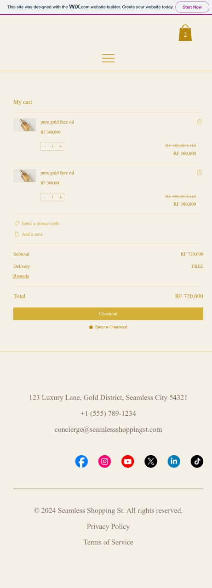

# E-commerce_day_program_group4_24579-2024

## student information:
- name: Malaz Mohammed Ibrahim
- reg.number: 24579/2024
- course: E-commerce and web applications
 # **Velora Luxury SkinCare Brand Website**

  ### Platform used:
  Wix Harmony Editor.

  ## features implemented:
  - elegeant homepage design
  - product showcase section with categories
  - about us page describing the brand identity
  - contact form for customer inquiries
  - interactive cart
  - profile management pages
  - responsive layout for mobile and desktop
  - high-quality skincare branding visuals and custom branding elements
  - smooth navigation between pages
## screenshots:
### home page:

### contact us: 

### products: 

### cart: 

## challenges:
- designing a luxury brand look and keeping it consistent
- creating images to match brand identity
- learning how to structure a full website project
- organizing layout and spacing for a clean UI
## lessons learned: 
- learned how to build a complete brand identity
-  improved UI/UX design skills
-  gained experience in responsive design
-  understood how branding affects user experience
## live website link:
[click here to view the live website](https://reemosamasalih.wixsite.com/velora)

## GitHub repository:
[click here to view GitHub repository](https://github.com/malazmohdibrahim/E-commerce_day_program_group4_24579-2024)
